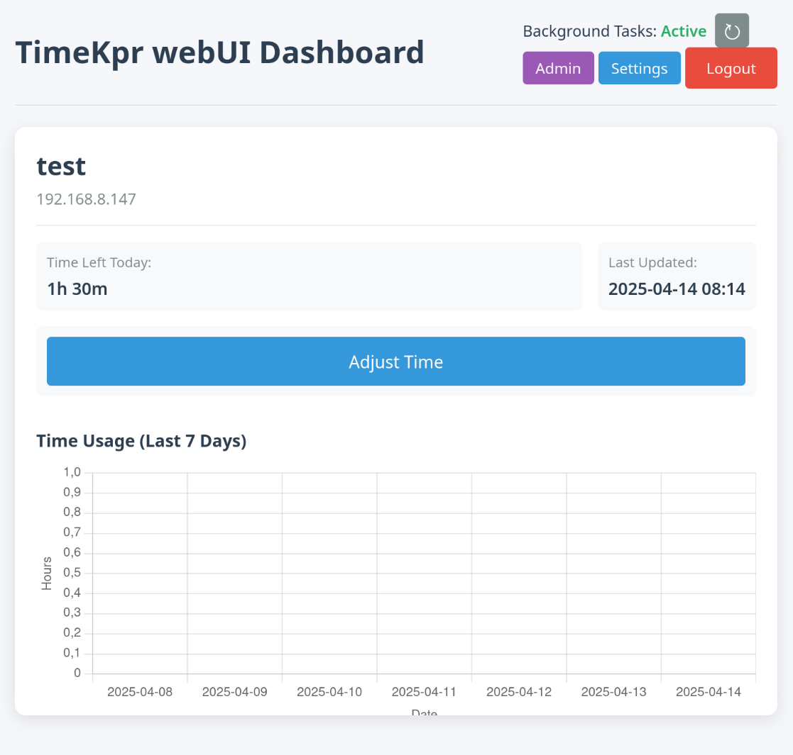

# Timekpr Remote Management Panel

A web-based dashboard for managing [Timekpr-nExT](https://mjasnik.gitlab.io/timekpr-next/) instances in your home network:
- app contains basic web UI, 
- database for holding managed PCs data,
- background task that periodically connects via ssh to managed PCs. 

SSH connections invoke remotely 'timekpra' commands to modify settings remotely.  
App is designed to be launched easily from docker container.

**Important feature (and main reason why I created own app) was to have background task that would try to apply timing changes also to PCs that are currently powered off. As soon as they are started they will be updated with new time limits.**




## Prerequisites
- Python 3.6+
- Flask and SQLAlchemy
- Paramiko (for SSH)
- Timekpr installed on target computers
- SSH access to managed computers (using timekpr-remote user)

## Installation

The easiest way to deploy the application is using Docker and Docker Compose.

1. Clone the repository:
   ```bash
   git clone https://github.com/yourusername/timekpr-remote.git
   cd timekpr-remote
   ```

2. Deploy with Docker Compose:
   ```bash
   docker-compose up -d
   ```

   This will:
   - Build the Docker image
   - Start the container
   - Map port 5000 to your host
   - Create a persistent volume for the database
   - Configure the container to restart automatically

3. Access the web interface at `http://localhost:5000`

The application data will be stored in the `./data` directory on your host, making it persistent across container restarts.

### Manual Installation (Alternative)

If you prefer to run the application without Docker:

1. Create and activate a virtual environment:
   ```bash
   python -m venv venv
   source venv/bin/activate  # On Windows: venv\Scripts\activate
   ```

2. Install required packages:
   ```bash
   pip install -r requirements.txt
   ```

3. Start the application:
   ```bash
   python app.py
   ```

## Setting Up Remote Access

On each computer you want to manage:

1. Install Timekpr if not already installed:
   ```bash
   sudo apt install timekpr-next
   ```

2. Create a dedicated user for remote management:
   ```bash
   sudo adduser timekpr-remote
   ```

3. Add created user to timekpr group:
   ```bash
   sudo usermod -aG timekpr timekpr-remote
   ```
4. Be sure to set password for created user timekpr-remote to be same as password you will set for 'admin' user in following steps!
   ```bash
   sudo passwd timekpr-remote
   ```

5. Set up SSH access from your central server to this user

## Usage

1. **Login**: Access the web interface and login with the default credentials:
   - Username: `admin`
   - Password: `admin`
   
   (Be sure to change the default password in the Settings page)

2. **Add Users**: Navigate to the Admin page to add users you want to manage
   - Enter the username (as configured in Timekpr)
   - Enter the IP address of the computer

3. **Dashboard**: View time usage statistics and manage time limits
   - See remaining time for each user
   - Add or subtract time as needed
   - View weekly usage patterns

4. **Settings**: Manage application settings
   - Change admin password (affects both web login and SSH connections)

## Security Considerations

- Change the default password immediately after installation
- Consider setting up HTTPS for production use
- Limit access to the web interface using a firewall or reverse proxy
- Set up proper SSH key-based authentication for remote access


## Acknowledgements

- This project works with [Timekpr-nExT](https://mjasnik.gitlab.io/timekpr-next/), a parental control tool for Linux
- Built with Flask, SQLAlchemy, and Paramiko
- Inspired by [timekpr-next-remote] (https://github.com/mrjones-plip/timekpr-next-remote): I learnet there that timekpt can be managed via CLI remotely. Main reason why I created my own version was need to have bockground service that would apply changes also on PCs that currently are powered down. 